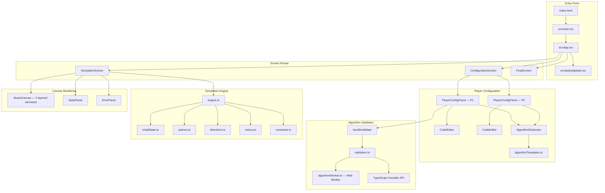
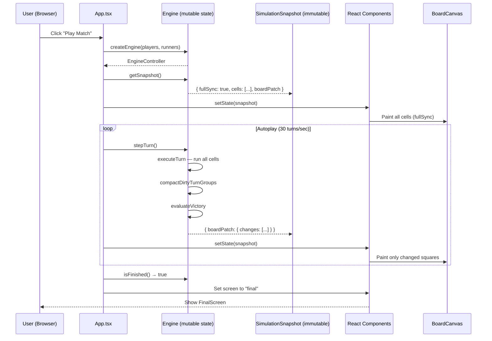
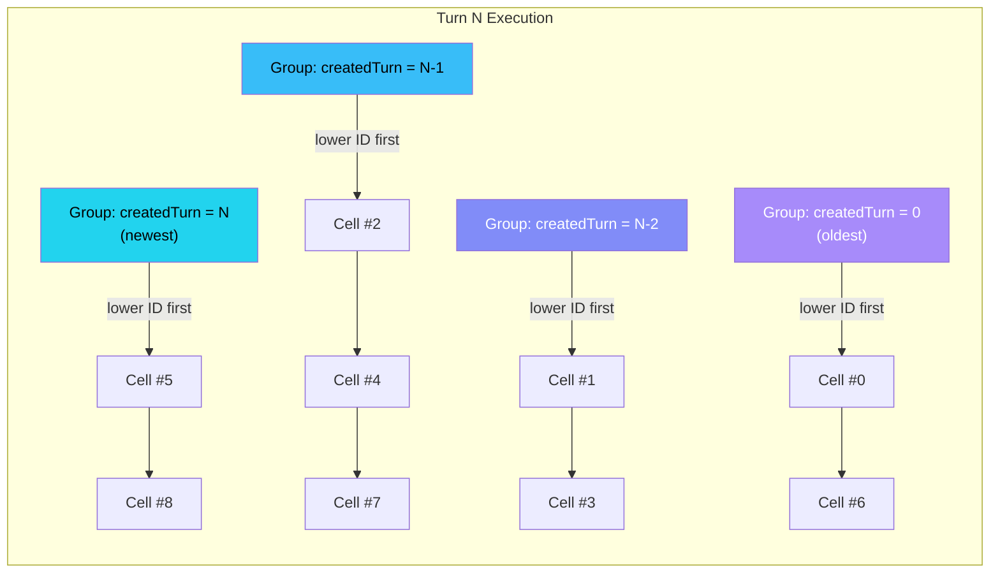
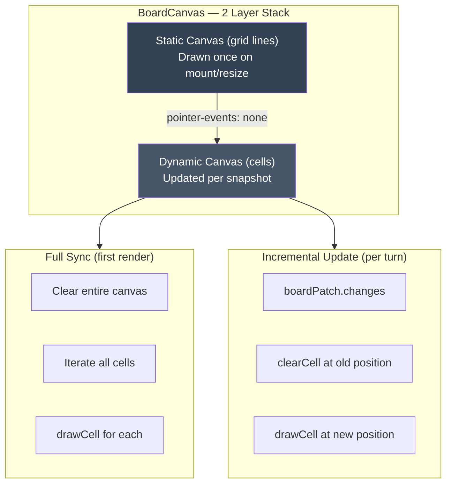
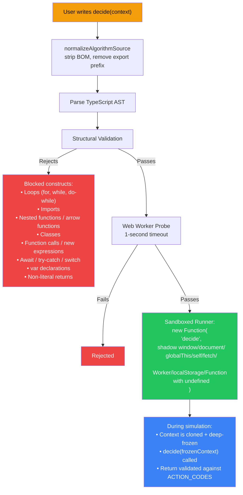

# Battle of Cells — Full Process Flow Diagram

## High-Level Architecture



## Complete Process Flow — From Start to Finish

```mermaid
flowchart TD
    START([App Startup]) --> LOAD[Load stored config from localStorage]
    LOAD --> |No stored data| DEFAULTS[Use TEAM_DEFAULTS]
    LOAD --> |Has stored data| RESTORE[Restore saved player drafts]
    DEFAULTS --> CONFIG_SCREEN
    RESTORE --> CONFIG_SCREEN

    CONFIG_SCREEN[Configuration Screen] --> P1_SET[Player 1: Set Team Name, Color, Algorithm]
    CONFIG_SCREEN --> P2_SET[Player 2: Set Team Name, Color, Algorithm]

    P1_SET --> VALIDATE_P1{Validate Algorithm?}
    P2_SET --> VALIDATE_P2{Validate Algorithm?}

    VALIDATE_P1 -->|Click Validate| STRUCT_VALID
    VALIDATE_P2 -->|Click Validate| STRUCT_VALID

    subgraph VALIDATION["Validation Pipeline"]
        STRUCT_VALID[normalizeAlgorithmSource] --> PARSE[Parse TypeScript AST]
        PARSE --> CHECK_FUNC{Exactly 1 "decide" function\nwith 1 parameter?}
        CHECK_FUNC -->|No| FAIL_STRUCT[Reject: structural error]
        CHECK_FUNC -->|Yes| WALK[Walk AST — reject dangerous constructs]
        WALK --> REJECT{Loops / Imports / Nested functions /\nFunction calls / Classes / Await / Try-catch?}
        REJECT -->|Yes| FAIL_STRUCT
        REJECT -->|No| CHECK_RETURNS[Validate return statements\nare literal ActionCodes]
        CHECK_RETURNS -->|Invalid code| FAIL_STRUCT
        CHECK_RETURNS -->|Valid| WORKER_PROBE[Run probe in Web Worker\n1-second timeout]
        WORKER_PROBE -->|Throws / Timeout| FAIL_WORKER[Reject: runtime error]
        WORKER_PROBE -->|Returns valid action| PASS[Validation PASSED]
    end

    FAIL_STRUCT --> SHOW_ERR[Show validation errors in UI]
    FAIL_WORKER --> SHOW_ERR
    PASS --> ENABLE_START[Enable "Play Match" button]

    ENABLE_START --> START_MATCH{Click Play Match}

    START_MATCH --> CAN_START{Team names unique\n& non-empty\n& both valid?}
    CAN_START -->|No| CONFIG_SCREEN
    CAN_START -->|Yes| BUILD_ENGINE

    subgraph ENGINE_SETUP["Engine Initialization"]
        BUILD_ENGINE[createAlgorithmRunner × 2] --> INIT_STATE[createInitialState]
        INIT_STATE --> OCC[Int32Array 20000 occupancy grid — all -1]
        OCC --> SPAWN[Spawn starting cells]
        SPAWN --> P1_SPAWN[P1 cell → left half\ncols 8-40]
        SPAWN --> P2_SPAWN[P2 cell → right half\ncols 140-192]
        P1_SPAWN --> MAPS[Initialize tracking maps:\ncellsById, aliveCells,\ncellsByCreatedTurn]
        P2_SPAWN --> MAPS
    end

    BUILD_ENGINE --> SIM_SCREEN

    SIM_SCREEN[Simulation Screen] --> AUTOPLAY

    subgraph GAME_LOOP["Game Loop — Per Turn"]
        AUTOPLAY[Autoplay: requestAnimationFrame\n30 turns/second] --> STEP[engine.stepTurn]
        STEP --> EXEC[executeTurn]

        EXEC --> ORDER[Build execution order]
        ORDER --> NEWEST_FIRST[Iterate createdTurnGroups\nREVERSE — newest first]
        NEWEST_FIRST --> CELL_LOOP{For each living cell}
        CELL_LOOP --> BUILD_CTX[buildCellContext\nCheck 8 neighbors via occupancy grid]
        BUILD_CTX --> CALL_ALG[call runners[teamId](context)]
        CALL_ALG --> USER_FN["User's decide(context)"]
        USER_FN --> RET[Return ActionCode string]
        RET --> PARSE_ACT[parseActionCode → kind + direction]
        PARSE_ACT --> RESOLVE{Resolve Action}

        RESOLVE -->|Move| MOVE[target inside board + empty → moveCell]
        RESOLVE -->|Eat| EAT[target enemy → removeCell + moveCell]
        RESOLVE -->|Reproduce| REPRO[target empty → reproduceCell]
        RESOLVE -->|Invalid| SKIP[Skip — action not performed]

        MOVE --> NEXT_CELL
        EAT --> NEXT_CELL
        REPRO --> NEXT_CELL
        SKIP --> NEXT_CELL

        NEXT_CELL{More cells?} -->|Yes| CELL_LOOP
        NEXT_CELL -->|No| COMPACT

        COMPACT[compactDirtyTurnGroups\nprune dead cells from buckets] --> VICTORY_CHECK

        VICTORY_CHECK{evaluateVictory}
        VICTORY_CHECK -->|Both teams 0| DRAW_MUTUAL[Mutual Elimination Draw]
        VICTORY_CHECK -->|One team 0| TEAM_WINS[Other team wins]
        VICTORY_CHECK -->|Turn 5000 reached| TURN_LIMIT[Winner by cell count\nor draw if tied]
        VICTORY_CHECK -->|Continue| INCREMENT[Increment currentTurn]
    end

    DRAW_MUTUAL --> RESULT
    TEAM_WINS --> RESULT
    TURN_LIMIT --> RESULT
    INCREMENT --> AUTOPLAY

    subgraph SNAPSHOT["Snapshot & Render"]
        INCREMENT --> SNAPS[toSnapshot]
        SNAPS --> PATCH[flushBoardPatch]
        PATCH --> FIRST{First snapshot?}
        FIRST -->|Yes| FULL[Full cell array — fullSync]
        FIRST -->|No| INCR[Incremental BoardPatch\ncells changed this turn]
        FULL --> REACT_COMMIT[React state update]
        INCR --> REACT_COMMIT
        REACT_COMMIT --> CANVAS[BoardCanvas redraws\nonly changed squares]
        REACT_COMMIT --> STATS[StatsPanel updates\ncell counts]
        REACT_COMMIT --> ERRORS[ErrorPanel shows\nruntime errors if any]
    end

    RESULT([Game Over]) --> FINAL_SCREEN
    subgraph ENDGAME["End of Match"]
        FINAL_SCREEN[Final Screen] --> SHOW_RESULT[Show winner / draw\nliving cells, final turn, cause]
        SHOW_RESULT --> NEW_MATCH{Click New Match}
        NEW_MATCH --> RESET[resetMatch → clear engine, state]
        RESET --> CONFIG_SCREEN

        MANUAL_END[User clicks End Match\nduring simulation] --> ENGINE_END[engine.endMatch\ncreateManualResult]
        ENGINE_END --> RESULT
    end

    style START fill:#22c55e,color:#fff
    style RESULT fill:#ef4444,color:#fff
    style PASS fill:#22c55e,color:#fff
    style FAIL_STRUCT fill:#ef4444,color:#fff
    style FAIL_WORKER fill:#ef4444,color:#fff
    style USER_FN fill:#f59e0b,color:#000
```

## Data Flow Between Engine and React



## Turn Execution Order Detail



**Turn order rule:** Newest cells act first. Within the same creation turn, lower internal ID acts first. This ensures newer cells (reproduced or spawned) get priority, making reproduction strategies meaningful.

## Board Rendering Architecture



## Security & Sandboxing Model


