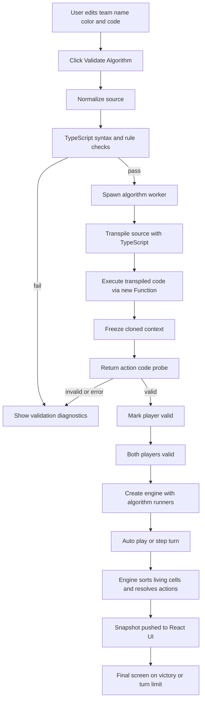
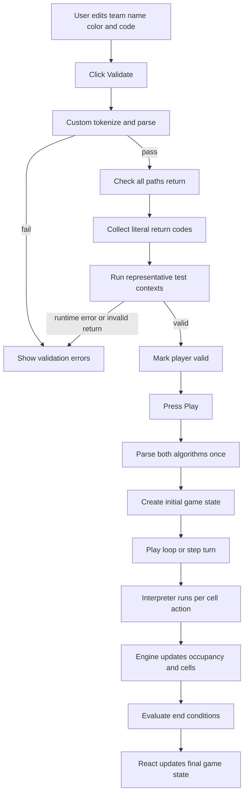

# Process Difference Diagram

This document compares the runtime process used by the `second` branch and the `code-fixed` branch.

## High-Level Comparison

```mermaid
flowchart LR
    A[Player writes decide(context)] --> B{Branch}

    B --> S1[second]
    B --> C1[code-fixed]

    S1 --> S2[TypeScript AST validation]
    S2 --> S3[Transpile with TypeScript]
    S3 --> S4[Run probe in worker]
    S4 --> S5[new Function sandbox attempt]
    S5 --> S6[Create algorithm runner]
    S6 --> S7[Engine executes turns]
    S7 --> S8[React updates snapshot UI]

    C1 --> C2[Custom tokenizer and parser]
    C2 --> C3[Restricted interpreter validation]
    C3 --> C4[Run sample contexts]
    C4 --> C5[Parse once at match start]
    C5 --> C6[Interpreter executes per cell]
    C6 --> C7[Engine executes turns]
    C7 --> C8[React updates game state UI]
```

## Branch `second`



## Branch `code-fixed`



## Process Differences

```mermaid
flowchart TD
    D1[Validation technology] --> D2[second: TypeScript compiler + worker + new Function]
    D1 --> D3[code-fixed: custom parser + interpreter]

    D4[Execution model] --> D5[second: transpile once then execute generated JS]
    D4 --> D6[code-fixed: interpret restricted AST directly]

    D7[Security boundary] --> D8[second: sandbox by hiding globals]
    D7 --> D9[code-fixed: no eval or Function constructor]

    D10[Testing support] --> D11[second: test script exists but no test files]
    D10 --> D12[code-fixed: engine and stress scripts included]

    D13[Bundle impact] --> D14[second: large client bundle from TypeScript-based validation]
    D13 --> D15[code-fixed: smaller client bundle with custom interpreter]

    D16[UX flow] --> D17[second: persistence and speed controls]
    D16 --> D18[code-fixed: simpler UI flow]
```



## Summary

- `second` uses the TypeScript compiler and a worker-based probe before creating runtime algorithm runners.
- `code-fixed` uses a custom restricted-language interpreter from validation through simulation.
- `second` has the stronger UI flow.
- `code-fixed` has the stronger execution model, smaller bundle, and better verification support.
