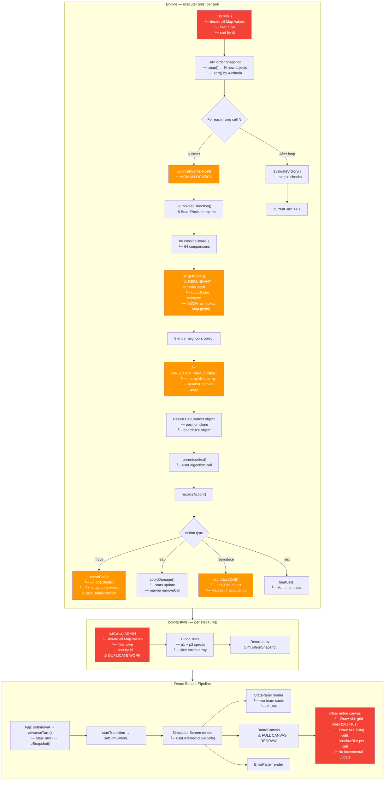

# Simulation Bottleneck Analysis

## Bottleneck Priority (worst first)

| # | Bottleneck | Location | Impact | Why |
|---|-----------|----------|--------|-----|
| **1** | **Redundant double sort** | `listCells()` in `toSnapshot` + `executeTurn` | HIGH | Every turn sorts all alive cells **twice** — once by `id` in `listCells`, then again by 4 criteria in `executeTurn`. The first sort is thrown away. |
| **2** | **Full Map scan per turn** | `listCells()` iterates `cellsById.values()` | HIGH | Iterates **every cell ever created** (dead + alive), filters alive. With 20k+ cells over a match, this grows linearly with total cells, not just alive cells. |
| **3** | **`buildCellContext` object flood** | Engine line 80–120 | HIGH | Creates `N × 8` BoardPosition objects + `N × 2` arrays + `N` CellContext objects per turn. For 10k cells = ~110k allocations/turn. Major GC pressure. |
| **4** | **Canvas full redraw every frame** | `BoardCanvas.tsx` | MEDIUM | Redraws grid lines (302 lines) and every cell every frame. Grid lines are static — should be drawn once to an offscreen canvas. `shadowBlur` per cell also hurts. |
| **5** | **Redundant `isInsideBoard` in `getCellAt`** | `engine.ts:72` | MEDIUM | Callers already check bounds, but `getCellAt` checks again. 8× per cell × N cells = thousands of redundant comparisons. |
| **6** | **`setInterval` + `startTransition` race** | `App.tsx:255` | LOW | `setInterval` queues turns regardless of whether React has finished rendering the previous frame. With `startTransition`/`useDeferredValue`, renders stack up. |

## Fix Recommendations

1. **Combine sorts**: Remove `listCells()` sort, use a single sort in `executeTurn` with all 4 criteria
2. **Maintain an alive-cell list**: Keep a separate array/set of alive cell IDs to avoid scanning dead cells
3. **Cache context allocations**: Reuse a single `CellContext` object and mutate it instead of allocating
4. **Offscreen canvas for grid**: Draw the grid once, only redraw cells on top
5. **Remove `isInsideBoard` from `getCellAt`**: Make it a raw lookup, let callers validate
6. **Batch turns**: Execute multiple turns before triggering a React update, emit snapshots at animation-frame rate instead of per-turn
